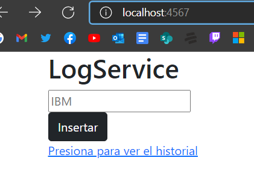
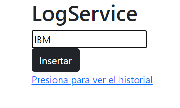
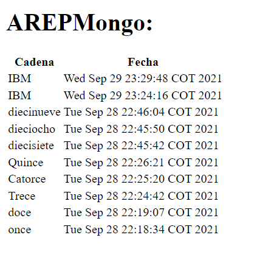
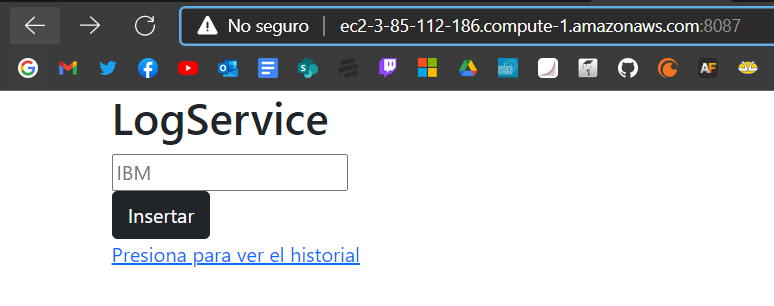

# TALLER DE DE MODULARIZACIÓN CON VIRTUALIZACIÓN E INTRODUCCIÓN A DOCKER Y A AWS

El taller es una aplicación web usando Spark java. Esta aplicación se construyo en un container
para docker para la aplicación, se desplegó y se probó en una maquina local. Por ultimo se desplegó
el contenedor que se creo en una maquina virtual en AWS con Docker instalado

## Autor
* Javier Esteban López Peña

## Contrucción
* Visual Studio Code - Editor de código y ambiente de desarrollo
* Maven - Gestor de dependencias
* BootStrap

## Prerequisites
* Docker - Container Manager
* Java 8 - Development Environment
* Git - Version Control System
* Spark - Micro framework for creating web applications in Java 8

## Screenshots

Pantalla Principal

Insertar dato

Ultimos 10 Logs

AWS Despliegue

